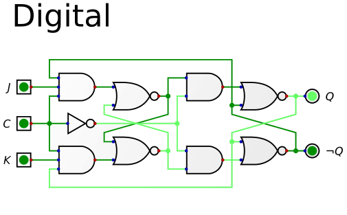

# TecDigital
__UNLZ - FI__   
__Alumno:__ Daniel Antonio Lorenzo 

__Descripción:__ prácticas realizadas por mi durante el curso de computación para ingenieros en la UNLZ - FI.   
Se ofrece libremente, sin garantía.

    

## Indice

[Modelo de final](https://nbviewer.jupyter.org/github/daniel-lorenzo/TecDigital/blob/master/final.ipynb)  
[Modelo de examen (práctica 1)](https://nbviewer.jupyter.org/github/daniel-lorenzo/TecDigital/blob/master/practica_1.ipynb)     
[Siete segmentos cátodo común](https://nbviewer.jupyter.org/github/daniel-lorenzo/TecDigital/blob/master/7seg_cc.ipynb)          